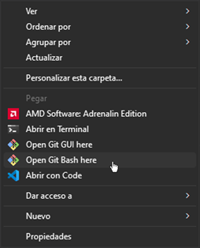
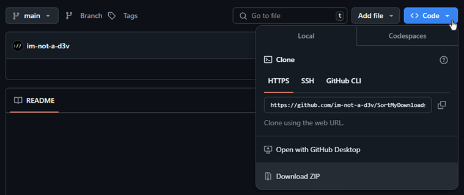
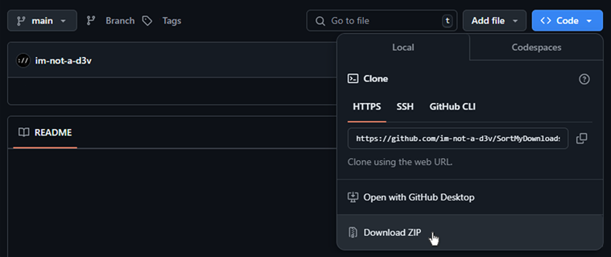
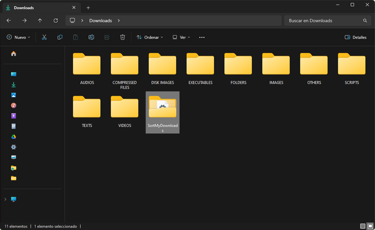

#  Sort my Downloads v1.0.0

[](#)
[](#)

## Descripción
Script Bash para la organización automatizada de archivos en la carpeta de Descargas en sistemas Windows utilizando Git Bash.

Este script está diseñado para organizar los archivos ubicados en la carpeta de Descargas del usuario en un entorno Windows, empleando `Git Bash` como intérprete. Su funcionamiento consiste en crear un conjunto de directorios dentro de la carpeta Descargas y clasificar los archivos automáticamente, moviéndolos a las carpetas correspondientes según su tipo o extensión. Esta solución permite una gestión eficiente y ordenada de los archivos descargados, mejorando la organización del sistema.


## 🟧 Formatos y sus destinos:

- 🔸 `TEXTS`: Archivos de texto y documentos (.txt, .pdf, .docx, .xlsx, .pptx, etc.)
  
- 🔸 `AUDIOS`: Archivos de audio (.mp3, .wav, .flac, etc.)
  
- 🔸 `VIDEOS`: Archivos de video (.mp4, .avi, .mkv, etc.)
  
- 🔸 `IMAGES`: Imágenes y gráficos (.jpg, .png, .svg, etc.)
  
- 🔸 `COMPRESSED FILES`: Archivos comprimidos (.zip, .rar, .7z, etc.)
  
- 🔸 `EXECUTABLES`: Ejecutables y archivos de instalación (.exe, .msi, .deb, etc.)
  
- 🔸 `SCRIPTS`: Archivos de scripts (.sh, .py, .js, etc.)
  
- 🔸 `DISK IMAGES`: Imágenes de disco y archivos relacionados (.iso, .img, .vhd, etc.)
  
- 🔸 `FOLDERS`: Directorio para carpetas no clasificadas.
  
- 🔸 `OTHERS`: Archivos no clasificados por tipo.

## 🟧 Funcionalidades:
- 🔸 Clasificación automática de archivos.
    
- 🔸 Renombrado de archivos duplicados.

- 🔸 Creación automática de directorios.

- 🔸 Categorización de múltiples tipos de archivo.

- 🔸 Clasificación de carpetas no categorizadas.

- 🔸 Gestión de archivos no clasificados.

- 🔸 Soporte de ejecución en su propio directorio.

- 🔸 Compatibilidad con Git Bash en Windows.

## 🟧 Requisitos:
- 🔸 Sistema operativo Window. (No probado en Linux)
- 🔸 <a href="https://git-scm.com/downloads/win">Git Bash para Windows</a> para ejecutar la ejecución del script).

## 🟧 Descarga y configuración:

1. 🟠 Instalar <a href="https://git-scm.com/downloads/win">Git Bash en Windows</a> (o cualquier otro interprete de Bash).

2. 🟠 Clonar o descargar el repositorio con el script.
   - 🔸 Opción #1: Clonado de repositorio:
      - Dirígete a `Descargas` (o `Downloads`.) y abre `Git Bash` ahi.
  
        

      - Ejecuta el comando:
         ```bash
        git clone https://github.com/im-not-a-d3v/SortMyDownloads.git
         ```
        
        > [!NOTE]
        > Tras esto deberías tener una carpeta llamada "SortMyDownloads" dentro de Descargas (Downloads).

    <br>

    - 🔸 Opción #2: Descarga directa:
        - Dentro de la repo clic `<> Code`.

            
        
        - Clic en `Download ZIP` y descarga el archivo .zip

            

        - Abre el `.zip` y extrae la carpeta `SortMyDownloads-main`, en `Descargas` (`Downloads`)
 
 <br>

3. 🟠 En tu interprete de Bash estando dentro de `Descargas` (`Downloads`) Ejecuta el script con el siguiente comando para darle permisos de ejecución al script y luego ejecutarlo por primera vez.
   ```bash
   cd SortMyDownloads*
   chmod +x SortMyDownloads.sh
   bash SortMyDownloads.sh
   ``` 

   <small> Si todo salio bien, dentro de la carpeta `Descargas` veras la carpeta `SortMyDownloads` junto a 10 nuevas carpetas creadas. </small>

     

4. 🟠 Para finalizar: Eliminamos la carpeta `SortMyDownloads` junto a los archivos innecesarios.
   ```bash
   cd ..
   rm -r SortMyDownloads*/
   ``` 
    <p> Dentro de la carpeta SCRIPT tendremos la carpeta final `SortMyDownloads` unicamente con los archivos necesarios.</p>

<br>

## 🟧 Métodos de ejecución:

- 🟠 Manual
  - 🔸 Opción A:
    ir a la ruta que aloja el script `\Downloads\SCRIPTS\SortMyDownloads` doble clic en `SortMyDownloads.sh` para ejecutarlo.
  - 🔸 Opción B: Crear un acceso directo `SortMyDownloads.sh` en la ruta deseada y ejecutarlo desde ahi.

- 🟠 Automático
    - 🔸 Opción A (Al iniciar del sistema): Presionamos `CTRL + R` y escribimos:

   ```cmd
    shell:startup
   ```
    Se abrirá una ventada en la sig. ruta `C:\Users\~tu usuario~\AppData\Roaming\Microsoft\Windows\Start Menu\Programs\Startup` ahi dentro colocaremos un acceso directo del archivo `SortMyDownloads.sh`.

> [!NOTE]  
> Con este método cada vez que el sistema inicie, el script se ejecutara y organizara las carpetas de forma automática.

<br>

<!-- ## 🟧 Activar y desactivar iconos personalizados (Opcional):

Si quieres aplicar los iconos personalizados, ejecuta el script `iconConfig.sh` que se encuentra dentro de `Descargas/SCRIPTS/SortMyDownloads`.

   ```bash
¿Deseas activar o desactivar los íconos personalizados de las carpetas?

1. Activar "Icons Pack #1".
2. Activar "Icons Pack #2".
0. Desactivar íconos.

Selecciona una opción:
   ``` -->

  

## Licencia
Proyecto bajo licencia [MIT.](LICENSE)